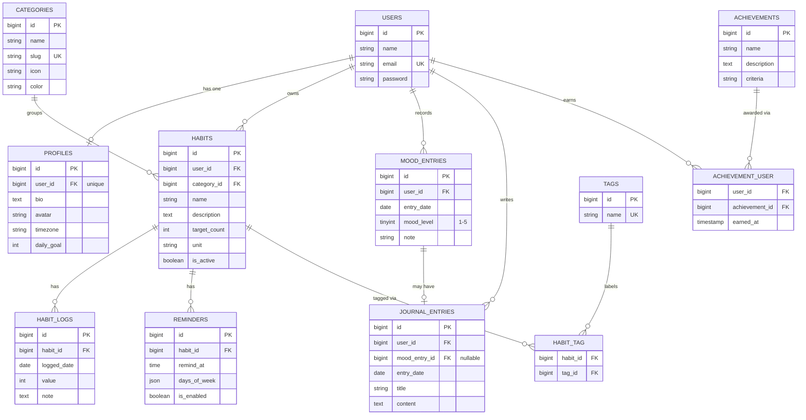

# Database Design — Entity Relationship Diagram

This document describes the database schema of **Habitude** and every Eloquent relationship used in the project.

## 1. Entity Relationship Diagram

## 2. Relationship Summary

| Type | Relationship | Eloquent |
|---|---|---|
| One-to-One | `User` ↔ `Profile` | `hasOne` / `belongsTo` |
| One-to-One (optional) | `MoodEntry` ↔ `JournalEntry` | `hasOne` / `belongsTo` |
| One-to-Many | `User` → `Habit` | `hasMany` / `belongsTo` |
| One-to-Many | `User` → `MoodEntry` | `hasMany` / `belongsTo` |
| One-to-Many | `User` → `JournalEntry` | `hasMany` / `belongsTo` |
| One-to-Many | `Category` → `Habit` | `hasMany` / `belongsTo` |
| One-to-Many | `Habit` → `HabitLog` | `hasMany` / `belongsTo` |
| One-to-Many | `Habit` → `Reminder` | `hasMany` / `belongsTo` |
| Many-to-Many | `Habit` ↔ `Tag` (pivot `habit_tag`) | `belongsToMany` |
| Many-to-Many + pivot data | `User` ↔ `Achievement` (pivot `achievement_user`, column `earned_at`) | `belongsToMany` + `withPivot` |
| Has-Many-Through | `User` → `HabitLog` through `Habit` | `hasManyThrough` |
| Has-Many-Through | `Category` → `HabitLog` through `Habit` | `hasManyThrough` |

## 3. Categories (seeded)

The `categories` table is populated by a seeder with the eight built-in themes:

| Name | Slug |
|---|---|
| Health & Fitness | `health-fitness` |
| Mindfulness | `mindfulness` |
| Productivity | `productivity` |
| Better Sleep | `better-sleep` |
| Stay Hydrated | `stay-hydrated` |
| Read More | `read-more` |
| Social Connections | `social-connections` |
| Self Care | `self-care` |

## 4. Design Notes

- **Unique constraints:** `profiles.user_id`, `categories.slug`, `tags.name`, and (`habit_logs.habit_id`, `habit_logs.logged_date`) so a habit has one log per day.
- **Daily mood:** (`mood_entries.user_id`, `mood_entries.entry_date`) is unique, giving one mood per user per day.
- **Journal ↔ mood link:** `journal_entries.mood_entry_id` is nullable and unique, so a journal entry can exist without a mood check-in, but a mood has at most one journal entry.
- **Cascade rules:** deleting a user cascades to their profile, habits, logs, reminders, moods, journals, and achievement links. Deleting a category is restricted while habits still use it.
- **Streaks** are computed from `habit_logs` and are not stored.
